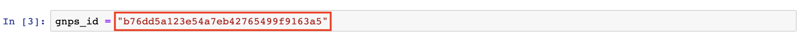
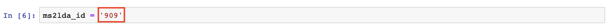
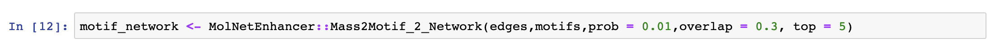

# RMolNetEnhancer

RMolNetEnhancer is an R package integrating chemical class and substructure information within mass spectral molecular networks created through the [Global Natural Products Social Molecular Networking (GNPS)](https://gnps.ucsd.edu/) platform. An analogous python module is available at https://github.com/madeleineernst/pyMolNetEnhancer.

### Table of contents

* [Installation](#installation)
* [Map MS2LDA substructural information to mass spectral molecular networks (classical)](#Mass2Motifs_to_Network_Classical)
* [Map MS2LDA substructural information to mass spectral molecular networks (feature based)](#Mass2Motifs_to_Network_FeatureBased)
* [Dependencies](#dependencies)
* [Main citation](#main_citation)
* [Other citations](#other_citations)
* [License](#license)

## Installation 

Install RMolNetEnhancer with:

 `devtools::install_github("madeleineernst/RMolNetEnhancer")`

## Map MS2LDA substructural information to mass spectral molecular networks (classical) 

In order to map substructural information to a mass spectral molecular network you need to:
 
* [Create a molecular network](https://ccms-ucsd.github.io/GNPSDocumentation/quickstart/) through the Global Natural Products Social Molecular Networking (GNPS) platform
* Create an LDA experiment on [http://ms2lda.org/](http://ms2lda.org/) using the MGF clustered spectra downloaded from GNPS:

Then execute the code in [Example_notebooks/Mass2Motifs_2_Network_Classical.ipynb](https://github.com/madeleineernst/RMolNetEnhancer/blob/master/Example_notebooks/Mass2Motifs_2_Network_Classical.ipynb) line by line.
The only things you need to specify are:

<ol>
  <li>Your GNPS job ID 
  </li>
  <li>Your MS2LDA job ID
  
  <b>Note</b>: Depending on the size of this file, a server connection timeout may occur. Alternatively, you may download the file manually at http://ms2lda.org/:  
  </li>
  <li>User-defined parameters for mapping the Mass2Motifs onto the network
  
  <tt>prob</tt>: minimal probability score for a Mass2Motif to be included. Default is 0.01.  
  <tt>overlap</tt>: minimal overlap score for a Mass2Motif to be included. Default is 0.3.  
  <b>Important</b>: The probability and overlap thresholds can be set within the ms2lda.org app as well under the Experimental Options tab. It is recommendable to do so when inspecting results in the web app. Importantly, the summary table contains filtered motif-document relations using the set thresholds in the web app.  
  <tt>top</tt>: This parameter specifies how many most shared motifs per molecular family (network component index) should be shown. Default is 5.
</li>
</ol>

To visualize results import the 'Mass2Motifs_Edges_Classical.tsv' output file as network into [Cytoscape](https://cytoscape.org/). Select column 'CLUSTERID1' as Source Node, column 'interact' as Interaction Type and 'CLUSTERID2' as Target Node:

Then import the 'Mass2Motifs_Nodes_Classical.tsv' output file as table:

To color edges based on shared Mass2Motifs in between nodes select 'Stroke Color' in the 'Edge' tab to the left and choose 'interaction' as <i>Column</i> and 'Discrete Mapping' as <i>Mapping Type</i>:

To color nodes by the most shared Mass2Motifs per molecular family (network component index) select 'Image/Chart' in the 'Node' tab to the left and select Mass2Motifs shown in 'TopSharedMotifs' in the Edge Table:

## Map MS2LDA substructural information to mass spectral molecular networks (feature based) 

In order to map substructural information to a mass spectral molecular network created through the feature based workflow you need to:

* [Create a feature based molecular network](https://ccms-ucsd.github.io/GNPSDocumentation/featurebasedmolecularnetworking/) through the Global Natural Products Social Molecular Networking (GNPS) platform
* Create an LDA experiment on [http://ms2lda.org/](http://ms2lda.org/) using the MGF file created within MZmine (see [GNPS documentation](https://ccms-ucsd.github.io/GNPSDocumentation/featurebasedmolecularnetworking/))

Then execute the code in [Example_notebooks/Mass2Motifs_2_Network_FeatureBased.ipynb](https://github.com/madeleineernst/RMolNetEnhancer/blob/master/Example_notebooks/Mass2Motifs_2_Network_FeatureBased.ipynb) line by line.
The only things you need to specify are:

<ol>
  <li>Your GNPS job ID 
  </li>
  <li>Your MS2LDA job ID
  
  <b>Note</b>: Depending on the size of this file, a server connection timeout may occur. Alternatively, you may download the file manually at http://ms2lda.org/:  
  </li>
  <li>User-defined parameters for mapping the Mass2Motifs onto the network
  
  <tt>prob</tt>: minimal probability score for a Mass2Motif to be included. Default is 0.01.  
  <tt>overlap</tt>: minimal overlap score for a Mass2Motif to be included. Default is 0.3.  
  <b>Important</b>: The probability and overlap thresholds can be set within the ms2lda.org app as well under the Experimental Options tab. It is recommendable to do so when inspecting results in the web app. Importantly, the summary table contains filtered motif-document relations using the set thresholds in the web app.  
  <tt>top</tt>: This parameter specifies how many most shared motifs per molecular family (network component index) should be shown. Default is 5.
</li>
</ol>

To visualize results import the 'Mass2Motifs_Edges_FeatureBased.tsv' output file as network into [Cytoscape](https://cytoscape.org/). Select column 'CLUSTERID1' as Source Node, column 'interact' as Interaction Type and 'CLUSTERID2' as Target Node:

Then import the 'Mass2Motifs_Nodes_FeatureBased.tsv' output file as table:

To color edges based on shared Mass2Motifs in between nodes select 'Stroke Color' in the 'Edge' tab to the left and choose 'interaction' as <i>Column</i> and 'Discrete Mapping' as <i>Mapping Type</i>:

To color nodes by the most shared Mass2Motifs per molecular family (network component index) select 'Image/Chart' in the 'Node' tab to the left and select Mass2Motifs shown in 'TopSharedMotifs' in the Edge Table:

## Dependencies
R version 3.4.2 (2017-09-28), devtools_2.0.1, plyr_1.8.4

## Main citation 
https://www.biorxiv.org/content/10.1101/654459v1  
https://github.com/madeleineernst/RMolNetEnhancer

## Other citations 
MolNetEnhancer uses molecular networking through GNPS:  
Wang, M.; Carver, J. J.; Phelan, V. V.; Sanchez, L. M.; Garg, N.; Peng, Y.; Nguyen, D. D.; Watrous, J.; Kapono, C. A.; Luzzatto-Knaan, T.; et al. Sharing and Community Curation of Mass Spectrometry Data with Global Natural Products Social Molecular Networking. Nat. Biotechnol. 2016, 34 (8), 828–837.
https://www.nature.com/articles/nbt.3597

MolNetEnhancer uses untargeted substructure exploration through MS2LDA:  
van der Hooft, J.J.J.; Wandy, J.; Barrett, M.P.; Burgess, K.E.V.; Rogers, S. Topic modeling for untargeted substructure exploration in metabolomics. PNAS 2016, 113 (48), 13738-13743.
https://www.pnas.org/content/113/48/13738

## License
This repository is available under the following license https://github.com/madeleineernst/RMolNetEnhancer/blob/master/LICENSE
